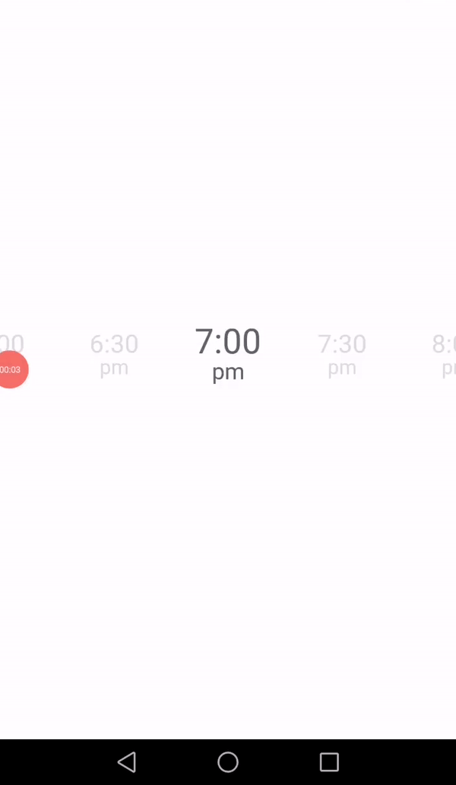

# infinite-horizontal-time-picker-react-native

A react native component that allows you to pick a specific time in an bidirectional scroll component. The selected item will be automatically centered in the middle of the screen.



## Installation

Run this command in order to have this component in your project directory.

```bash
npm install infinite-horizontal-time-picker-react-native
```

## Usage
```
import React from "react";
import { StyleSheet, View } from "react-native";
import HorizontalTimePiker from "infinite-horizontal-time-picker-react-native";

export default function App() {
  return (
    <View style={styles.container}>
      <HorizontalTimePiker
        selectedIndex={15}
        height={75}
        timeInterval={30}
        marginHorizontal={0}
        enabled={true}
        onChange={(val: string) => console.log(val)}
        visibleElements={4}
        mainColor={"#5A646B"}
        secondaryColor={"#DDDDDD"}
        fontSize={27}
        fontFamily={"normal"}
      ></HorizontalTimePiker>
    </View>
  );
}

const styles = StyleSheet.create({
  container: {
    flex: 1,
    backgroundColor: "#fff",
    alignItems: "center",
    justifyContent: "center",
  },
});
```
## Props
* **selectedIndex** - Set the default selected time.
* **height** - Height of the scroll component.
* **timeInterval** - Used to generate the schedule (in minutes).
* **marginHorizontal** - Used to set the horizontal margin of the inner component.
* **enabled** - Set true or false in order to enable the picker.
* **onChange** - Callback function called when there's a change in the picker - onChange(value: string).
* **visibleElements** - Defines the visible number of the elements in the scroll.
* **mainColor** - Text color of the selected item.
* **secondaryColor** - Text color of the remaining items.
* **fontSize** - Font size of the selected item (the others will be calculated according to a specific rule.
* **fontFamily** - Font family to be used.

# Pending Tasks
[ ] 24 hour support

[ ] When the user reaches the limit of the scrollview (backwards) in order to have infinite scroll the list will be populated by shifting the remaining items, which causes a small loading in the screen. The idea is to have another strategy to support backwards scroll.

# Contributing
This project is currently in beta stage. If you have any bug you want to report or any suggestion just create an issue.

## License
[MIT](https://choosealicense.com/licenses/mit/)
